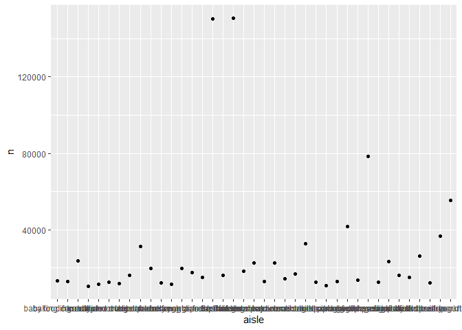
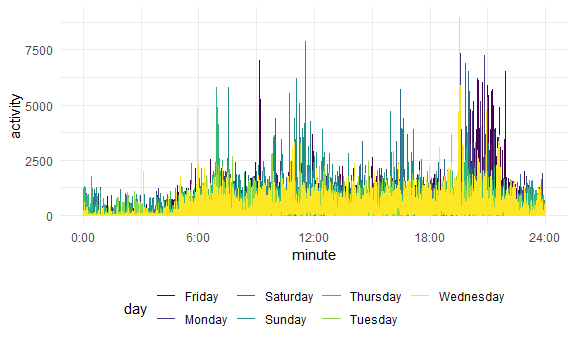

p8105\_hw3\_LF2649
================
Lin Feng
2020-10-10

Problem 1
=========

``` r
data("instacart")
head(instacart)
```

    ## # A tibble: 6 x 15
    ##   order_id product_id add_to_cart_ord~ reordered user_id eval_set order_number
    ##      <int>      <int>            <int>     <int>   <int> <chr>           <int>
    ## 1        1      49302                1         1  112108 train               4
    ## 2        1      11109                2         1  112108 train               4
    ## 3        1      10246                3         0  112108 train               4
    ## 4        1      49683                4         0  112108 train               4
    ## 5        1      43633                5         1  112108 train               4
    ## 6        1      13176                6         0  112108 train               4
    ## # ... with 8 more variables: order_dow <int>, order_hour_of_day <int>,
    ## #   days_since_prior_order <int>, product_name <chr>, aisle_id <int>,
    ## #   department_id <int>, aisle <chr>, department <chr>

This dataset contains 1384617 rows and 15 columns.

Observations are the level of items in orders by user. There are user / order variables -- user ID, order ID, order day, and order hour. There are also item variables -- name, aisle, department, and some numeric codes.

How many aisles, and which are most items from?
-----------------------------------------------

``` r
instacart %>% 
    count(aisle) %>% 
    arrange(desc(n))
```

    ## # A tibble: 134 x 2
    ##    aisle                              n
    ##    <chr>                          <int>
    ##  1 fresh vegetables              150609
    ##  2 fresh fruits                  150473
    ##  3 packaged vegetables fruits     78493
    ##  4 yogurt                         55240
    ##  5 packaged cheese                41699
    ##  6 water seltzer sparkling water  36617
    ##  7 milk                           32644
    ##  8 chips pretzels                 31269
    ##  9 soy lactosefree                26240
    ## 10 bread                          23635
    ## # ... with 124 more rows

Make a plot
-----------

``` r
instacart %>% 
    count(aisle) %>% 
    filter(n > 10000) %>% 
    mutate(
        aisle = factor(aisle),
        aisle = fct_reorder(aisle, n)
    ) %>% 
    ggplot(aes(x = aisle, y = n)) + 
    geom_point() + 
    theme(axis.text.x = element_text(angle = 90, vjust = 0.5, hjust = 1))
```



Make a table
------------

``` r
instacart %>% 
    filter(aisle %in% c("baking ingredients", "dog food care", "packaged vegetables fruits")) %>% 
    group_by(aisle) %>% 
    count(product_name) %>% 
    mutate(rank = min_rank(desc(n))) %>% 
    filter(rank < 4) %>% 
    arrange(aisle, rank) %>% 
    knitr::kable()
```

| aisle                      | product\_name                                 |     n|  rank|
|:---------------------------|:----------------------------------------------|-----:|-----:|
| baking ingredients         | Light Brown Sugar                             |   499|     1|
| baking ingredients         | Pure Baking Soda                              |   387|     2|
| baking ingredients         | Cane Sugar                                    |   336|     3|
| dog food care              | Snack Sticks Chicken & Rice Recipe Dog Treats |    30|     1|
| dog food care              | Organix Chicken & Brown Rice Recipe           |    28|     2|
| dog food care              | Small Dog Biscuits                            |    26|     3|
| packaged vegetables fruits | Organic Baby Spinach                          |  9784|     1|
| packaged vegetables fruits | Organic Raspberries                           |  5546|     2|
| packaged vegetables fruits | Organic Blueberries                           |  4966|     3|

Apples vs ice cream..
---------------------

``` r
instacart %>% 
    filter(product_name %in% c("Pink Lady Apples", "Coffee Ice Cream")) %>% 
    group_by(product_name, order_dow) %>% 
    summarize(mean_hour = mean(order_hour_of_day)) %>% 
    pivot_wider(
        names_from = order_dow,
        values_from = mean_hour
    )
```

    ## `summarise()` regrouping output by 'product_name' (override with `.groups` argument)

    ## # A tibble: 2 x 8
    ## # Groups:   product_name [2]
    ##   product_name       `0`   `1`   `2`   `3`   `4`   `5`   `6`
    ##   <chr>            <dbl> <dbl> <dbl> <dbl> <dbl> <dbl> <dbl>
    ## 1 Coffee Ice Cream  13.8  14.3  15.4  15.3  15.2  12.3  13.8
    ## 2 Pink Lady Apples  13.4  11.4  11.7  14.2  11.6  12.8  11.9

Problem 2
=========

Load and clean data
-------------------

-   Load, tidy, and otherwise wrangle the data.
-   Your final dataset should include all originally observed variables and values;
-   have useful variable names;
-   include a weekday vs weekend variable;
-   and encode data with reasonable variable classes.
-   Describe the resulting dataset (e.g. what variables exist, how many observations, etc).

``` r
accel_df = read_csv("./accel_data.csv") %>% 
  janitor::clean_names() %>% 
  rename_at(vars(starts_with("activity_")), funs(str_remove(., "activity_"))) %>% 
  pivot_longer(
    "1":"1440",
    names_to = "minute",
    values_to = "activity"
  ) %>% 
  mutate (minute = as.numeric(minute)) %>% 
  mutate( weekday = case_when(
    day %in% c("Monday","Tuesday","Wednesday","Thursday","Friday") ~ "weekday",
    day %in% c("Saturday","Sunday") ~ "weekend")
    ) %>% 
  relocate(week, day_id, weekday, minute, activity, day)
```

    ## Parsed with column specification:
    ## cols(
    ##   .default = col_double(),
    ##   day = col_character()
    ## )

    ## See spec(...) for full column specifications.

    ## Warning: `funs()` is deprecated as of dplyr 0.8.0.
    ## Please use a list of either functions or lambdas: 
    ## 
    ##   # Simple named list: 
    ##   list(mean = mean, median = median)
    ## 
    ##   # Auto named with `tibble::lst()`: 
    ##   tibble::lst(mean, median)
    ## 
    ##   # Using lambdas
    ##   list(~ mean(., trim = .2), ~ median(., na.rm = TRUE))
    ## This warning is displayed once every 8 hours.
    ## Call `lifecycle::last_warnings()` to see where this warning was generated.

``` r
head(accel_df)
```

    ## # A tibble: 6 x 6
    ##    week day_id weekday minute activity day   
    ##   <dbl>  <dbl> <chr>    <dbl>    <dbl> <chr> 
    ## 1     1      1 weekday      1     88.4 Friday
    ## 2     1      1 weekday      2     82.2 Friday
    ## 3     1      1 weekday      3     64.4 Friday
    ## 4     1      1 weekday      4     70.0 Friday
    ## 5     1      1 weekday      5     75.0 Friday
    ## 6     1      1 weekday      6     66.3 Friday

### Description

This accelerometers data frames contains 6 variables: week, day\_id, weekday, minute, activity, day. There are 50400 records in total that were collected on a 63 year-old male with BMI 25, who was admitted to the Advanced Cardiac Care Center of Columbia University Medical Center and diagnosed with congestive heart failure (CHF). The variable *activity* describes the activity counts for each minute of a 24-hour day starting at midnight.

Create each-day activity and a corresponding table
--------------------------------------------------

-   Traditional analyses of accelerometer data focus on the total activity over the day.
-   Using your tidied dataset, aggregate accross minutes to create a total activity variable for each day, and create a table showing these totals.
-   Are any trends apparent?

``` r
accel_df %>% 
  group_by(day_id, day) %>% 
  summarise(activity_day = sum(activity)) 
```

    ## `summarise()` regrouping output by 'day_id' (override with `.groups` argument)

    ## # A tibble: 35 x 3
    ## # Groups:   day_id [35]
    ##    day_id day       activity_day
    ##     <dbl> <chr>            <dbl>
    ##  1      1 Friday         480543.
    ##  2      2 Monday          78828.
    ##  3      3 Saturday       376254 
    ##  4      4 Sunday         631105 
    ##  5      5 Thursday       355924.
    ##  6      6 Tuesday        307094.
    ##  7      7 Wednesday      340115.
    ##  8      8 Friday         568839 
    ##  9      9 Monday         295431 
    ## 10     10 Saturday       607175 
    ## # ... with 25 more rows

### Trends:

It is hard to read some dinstictive trends from the table, but we can find that at day 24 and 31 we have the samllest count of activity, and the number is dramatcially samller than other day.

Make a plot
-----------

-   Accelerometer data allows the inspection activity over the course of the day.
-   Make a single-panel plot that shows the 24-hour activity time courses for each day and use color to indicate day of the week.
-   Describe in words any patterns or conclusions you can make based on this graph.

``` r
accel_df %>% 
ggplot( aes(x = minute, y = activity, color = day)) + 
  geom_line() + 
   scale_x_continuous(
    breaks = c(0, 360, 720, 1080, 1440), 
    labels = c("0:00", "6:00", "12:00", "18:00", "24:00"))
```

 \#\#\# Trends From this plot we can found that the most active time periods for this man are at night (approxiamtely from 7:30pm to 10:oopm) and before noon (about 10am to 12 am).
